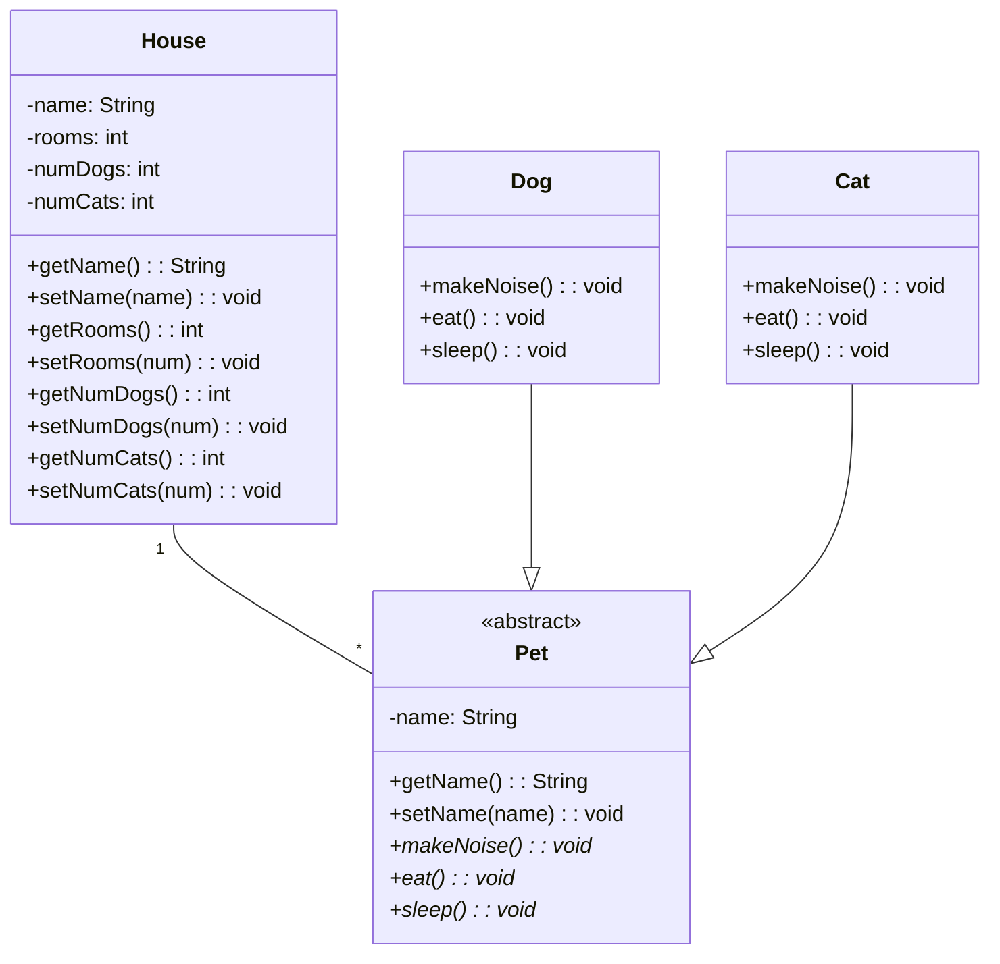

# Pets

## Requirements

- Create a class diagram for a house that can have zero to many pets living in it
- There are two types of pets that can live in a house: dogs and cats
- Each pet will have a name and can make a noise, eat, and sleep
- Pets can only live in one home

## UML

