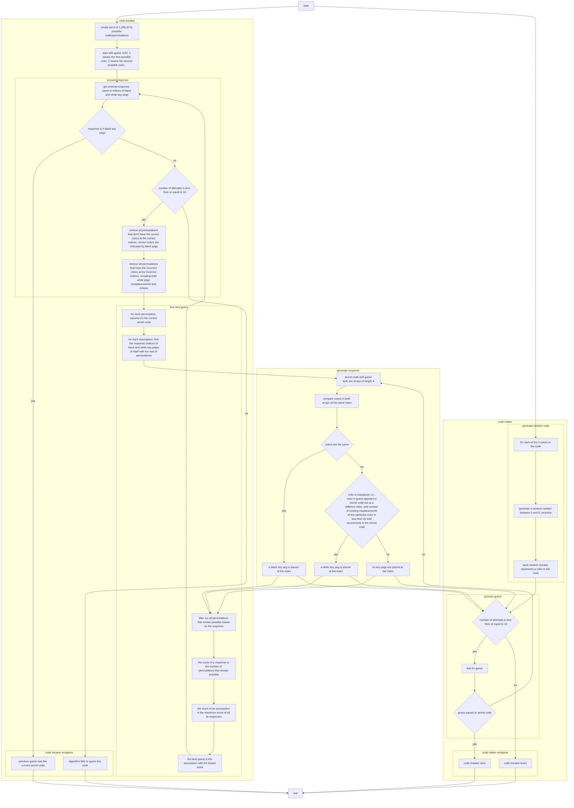

# Mastermind

The ICS4U culminating project.

## JavaFX

1. Go to [Install JavaFX](https://openjfx.io/openjfx-docs/#IDE-VSCode)
2. Follow Non-modular projects > IDE
3. As instructed, install JavaFX SDK to `/culminating-mastermind/lib`

## Launch

1. Open VS Code
2. Go to "Run and Debug" in the sidebar
3. Set launch task to "Launch Mastermind"
4. Launch

## Pseudocode

