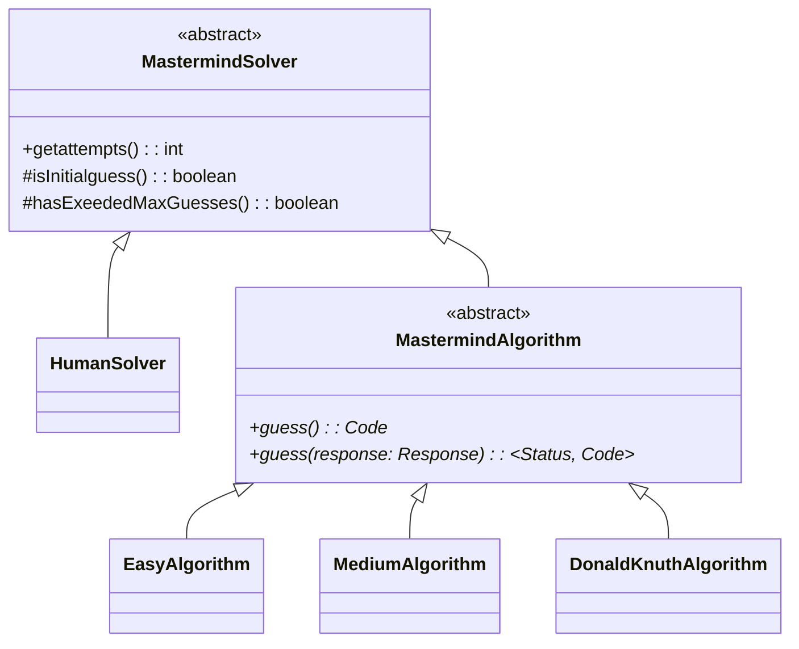
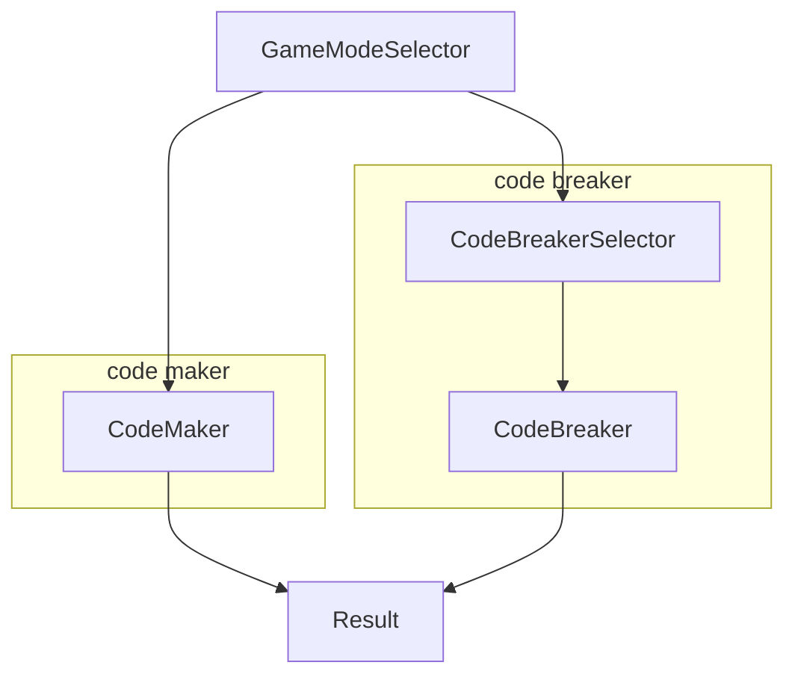
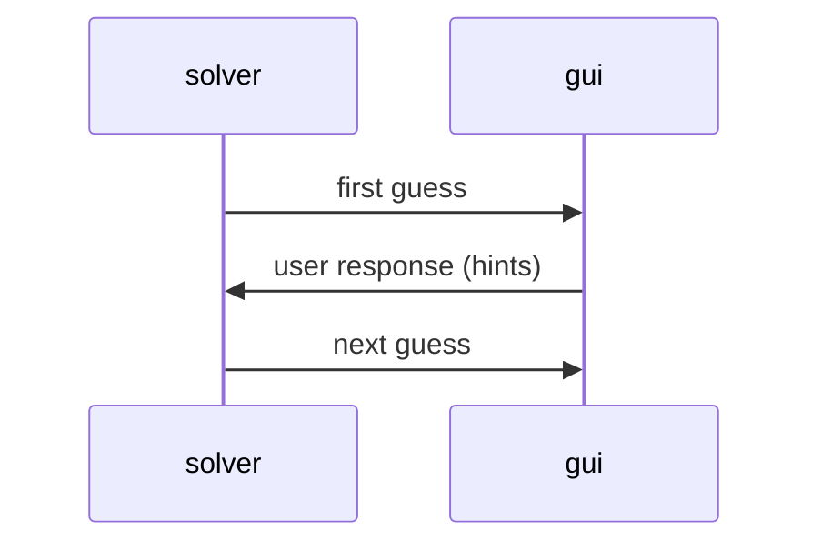
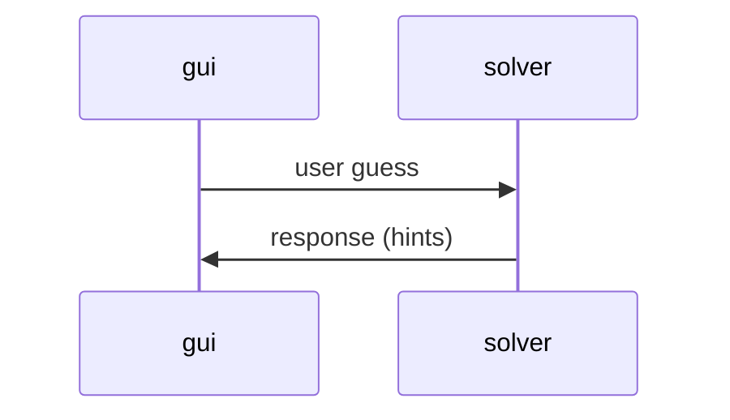

# Mastermind Project Wiki

## Project Structure

```tree
.
├── culminating-mastermind.iml
├── out
├── src
│   └── mastermind
│       ├── Mastermind.java
│       ├── core
│       │   ├── Code.java
│       │   ├── Response.java
│       │   └── solvers
│       │       ├── DonaldKnuthAlgorithm.java
│       │       ├── EasyAlgorithm.java
│       │       ├── HumanSolver.java
│       │       ├── MastermindAlgorithm.java
│       │       ├── MastermindSolver.java
│       │       └── MediumAlgorithm.java
│       ├── gui
│       │   ├── panels
│       │   │   └── GameBoard.java
│       │   └── scenes
│       │       ├── CodeBreaker.java
│       │       ├── CodeBreakerSelector.java
│       │       ├── CodeMaker.java
│       │       ├── GameModeSelector.java
│       │       ├── Result.java
│       │       └── Scene.java
│       └── utils
│           ├── MathUtil.java
│           └── Tuple2.java
└── wiki.md
```

### Editor Settings

- `culminating-mastermind.iml` Intellij configuration file

### Binary Files

- `out` Intellij build directory

### Project Sources

- `src/mastermind/core` core (non-gui) components of program
- `src/mastermind/core/solvers` algorithms for solving mastermind game
- `src/gui` gui components of program
- `src/gui/panels` shareable gui components
- `src/gui/scenes` scenes/stages/pages/screens of the game
  - each page/stage/screen of the program is a scene
  - e.g., game mode selector, code breaker gameplay, code maker gameplay
- `src/utils` general utilities that are not directly associated with program logic
  - i.e., components that can be reused by other projects
  - e.g., helper methods, data structures

## Solvers



## Scenes (GUI)

Each scene inherits `src/gui/scenes/Scene.java`.

### Transitions

Note that the node names correspond to classes in `src/gui/scenes`.



## Communications Between Solvers and GUI

### Algorithmic Solvers



### Human Solver


