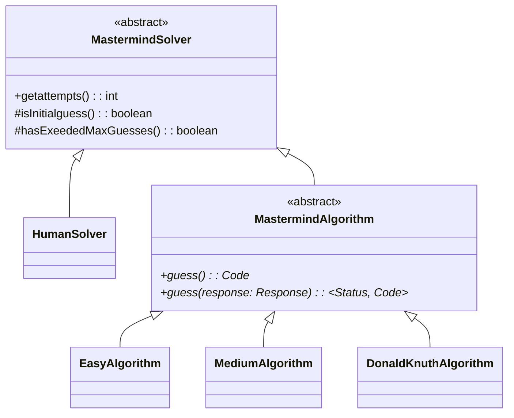
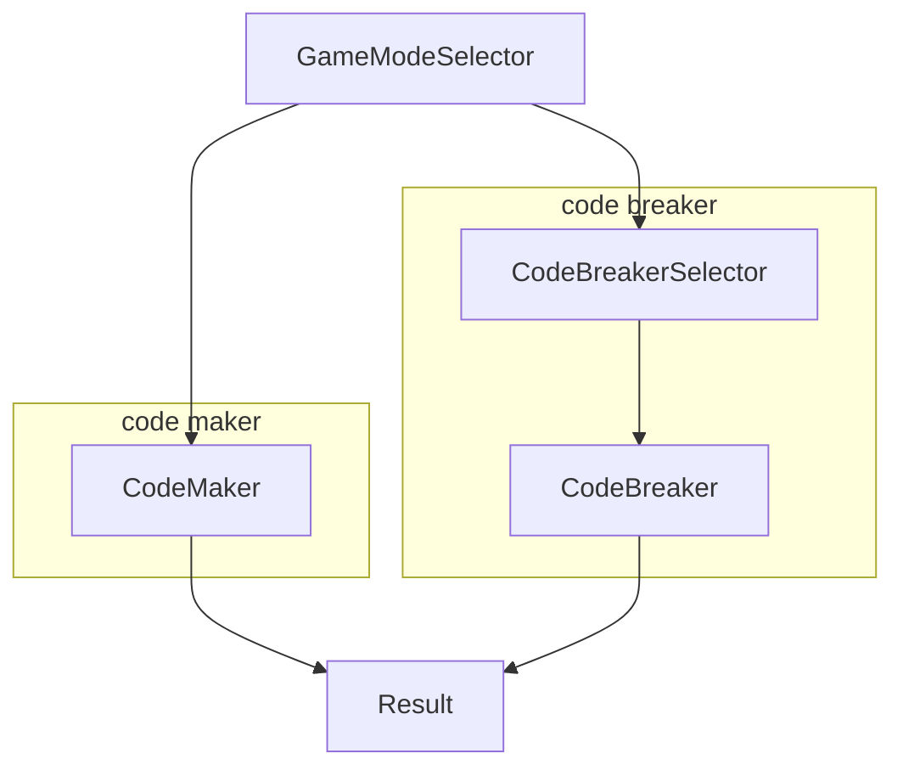
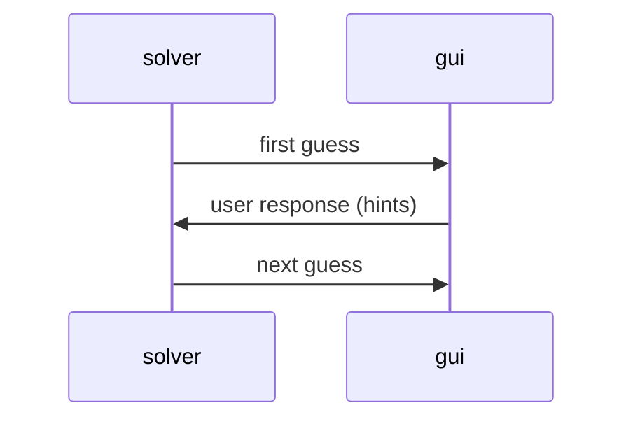
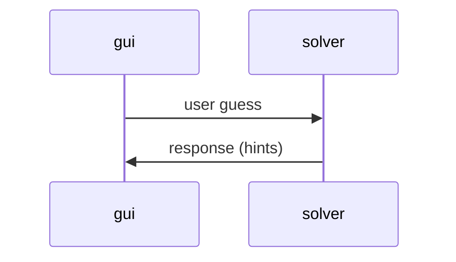

# Mastermind Project Wiki

## Project Structure

```tree
.
├── app
│   ├── bin
│   ├── build
│   └── src
│       ├── main
│       │   ├── java
│       │   │   └── mastermind
│       │   │       ├── core
│       │   │       │   └── solvers
│       │   │       ├── gui
│       │   │       │   ├── panels
│       │   │       │   └── scenes
│       │   │       └── utils
│       │   └── resources
│       └── test
│           ├── java
│           │   └── mastermind
│           └── resources
├── build
└── gradle
```

### Build Directories

- `app/bin`
- `app/build`
- `build`

### Gradle Directory

- `gradle`

### Project Sources

- `app/src/main/java/mastermind/core` core (non-gui) components of program
- `app/src/main/java/mastermind/core/solvers` algorithms for solving mastermind game
- `app/src/main/java/mastermind/gui` gui components of program
- `app/src/main/java/mastermind/gui/panels` shareable gui components
- `app/src/main/java/mastermind/gui/scenes` scenes/stages/pages/screens of the game
  - each page/stage/screen of the program is a scene
  - e.g., game mode selector, code breaker gameplay, code maker gameplay
- `app/src/main/java/mastermind/utils` general utilities that are not directly
  associated with program logic
  - i.e., components that can be reused by other projects
  - e.g., helper methods, data structures

### Unit Tests

- `app/src/test/java/mastermind`

## Solvers



## Scenes (GUI)

Each scene inherits `src/gui/scenes/Scene.java`.

### Transitions

Note that the node names correspond to classes in `src/gui/scenes`.



## Communications Between Solvers and GUI

### Algorithmic Solvers



### Human Solver


