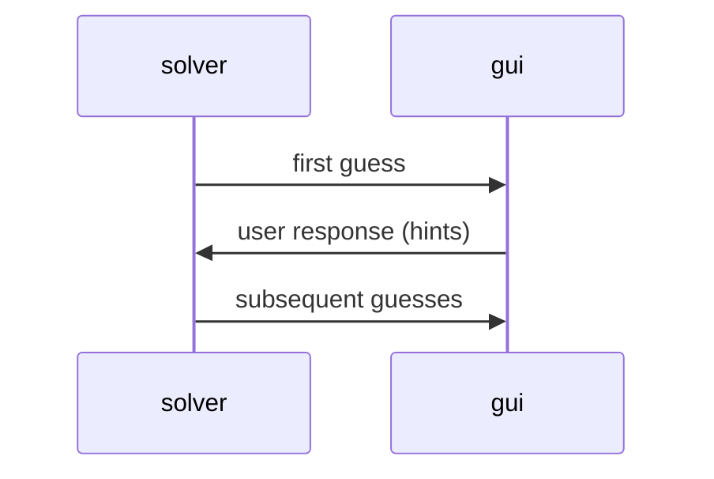
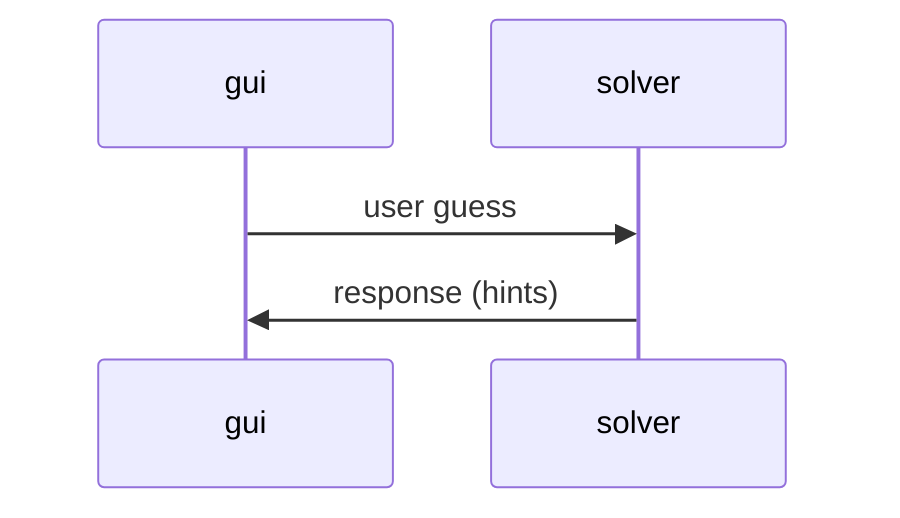

---
# Feel free to add content and custom Front Matter to this file.
# To modify the layout, see https://jekyllrb.com/docs/themes/#overriding-theme-defaults

layout: page
parent: Components
nav_order: 3
---

# Communications Between Core and GUI Components

## Algorithmic Solvers ↔ GUI

## Human Solver ↔ GUI

