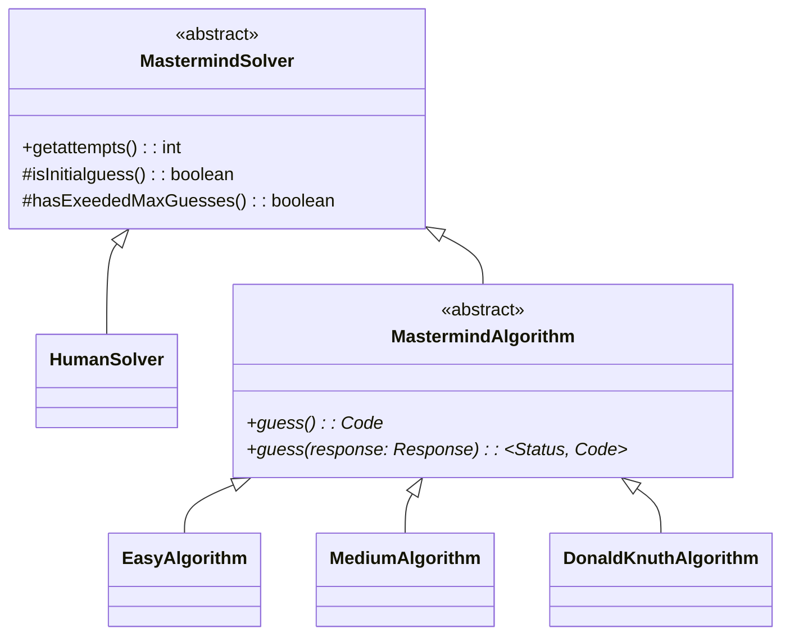

---
# Feel free to add content and custom Front Matter to this file.
# To modify the layout, see https://jekyllrb.com/docs/themes/#overriding-theme-defaults

layout: page
parent: Components
nav_order: 1
---

# Core Components

Components responsible for game logic.

## Code

Represents a code in the game. Each code is a sequence of 4 colors.

## Response

Represents the response to a guess. It contains the number of correct colors and
the number of correct colors in the correct position.

I.e., the number of black and white pegs.

## Solvers

### MastermindSolver

The ultimate base class. All solvers are derived from this class.

It defines a few utility methods that are common to all solvers.

### HumanSolver

The solver for code maker mode.

It compares user input against generated secret code and provides hints.

### MastermindAlgorithm

The standard interface for all algorithmic solvers.

It exposes two methods: `guess()` and `guess(response: Response)`, for the first
and subsequent guesses, respectively.

The GUI depends on above interface to communicate with the solver.

### DonaldKnuthAlgorithm

A MastermindAlgorithm implementation that uses Donald Knuth's 5-guess algorithm
to solve the game.

### MediumAlgorithm

TODO: description

### BasicAlgorithm

TODO: description
