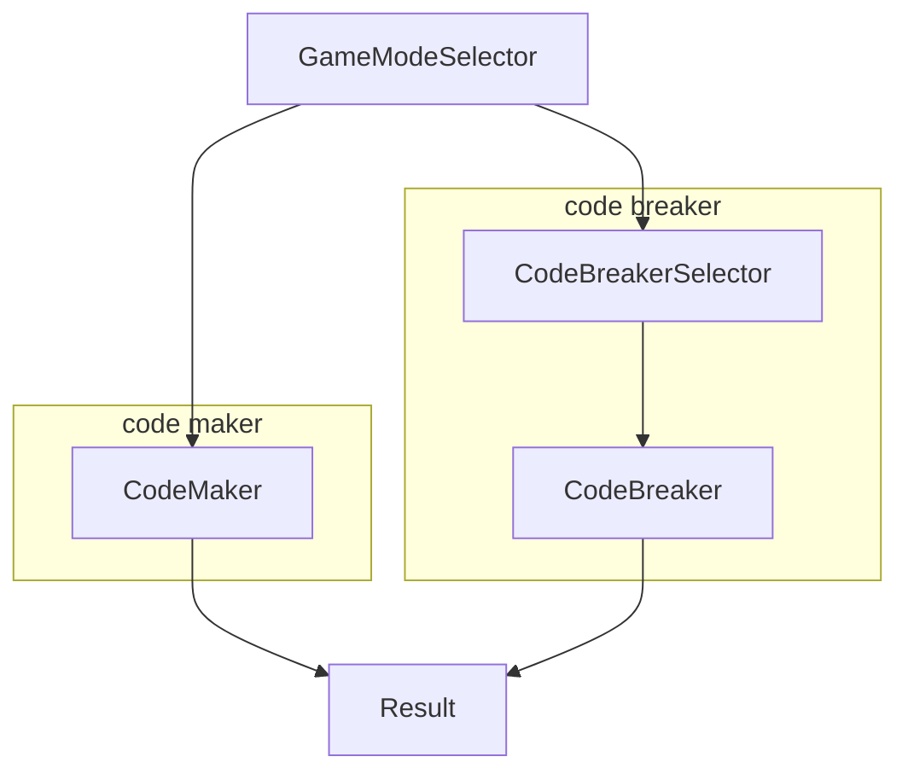

---
# Feel free to add content and custom Front Matter to this file.
# To modify the layout, see https://jekyllrb.com/docs/themes/#overriding-theme-defaults

layout: page
parent: Components
nav_order: 2
---

# GUI Components

Components responsible for user interaction.

## Panels

Reusable GUI components that can be shared across [scenes](#scenes).

### GameBoard

A game board that displays state of the game:

- The guesses, and
- The hints.

The game board is designed to look like a physical mastermind board.

### HomeButton

A home button that navigates to the first scene from any scenes.

## Scenes

Different screens of the game.

E.g., game mode selector, code breaker gameplay, code maker gameplay, etc.

### GameModeSelector

Prompts the user to select a game mode:

- code breaker: the program tries to guess a secret code with algorithms, or
- code maker: the user tries to guess a code that the program generates.

### CodeBreakerSelector

Prompts the user to select an algorithm to use for guessing the secret code:

- Donald Knuth's 5-guess algorithm, or
- Medium algorithm, or
- Basic algorithm.

### CodeBreaker

The actual code breaker gameplay.

### CodeMaker

The code maker gameplay.

### Result

The result screen to display whether the user/program wins/loses.
