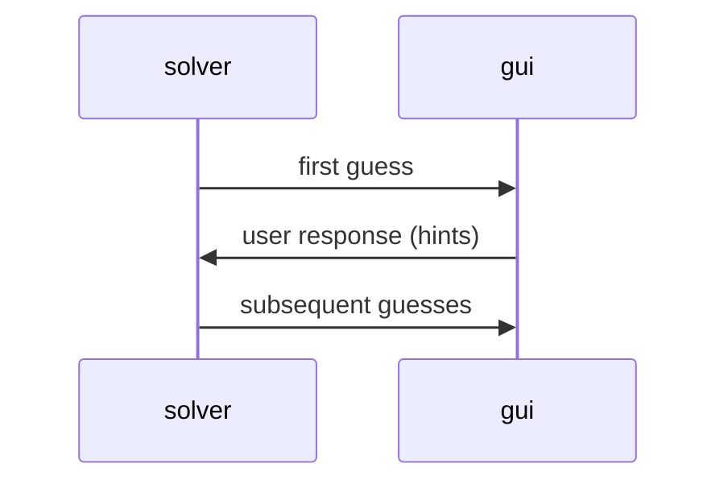
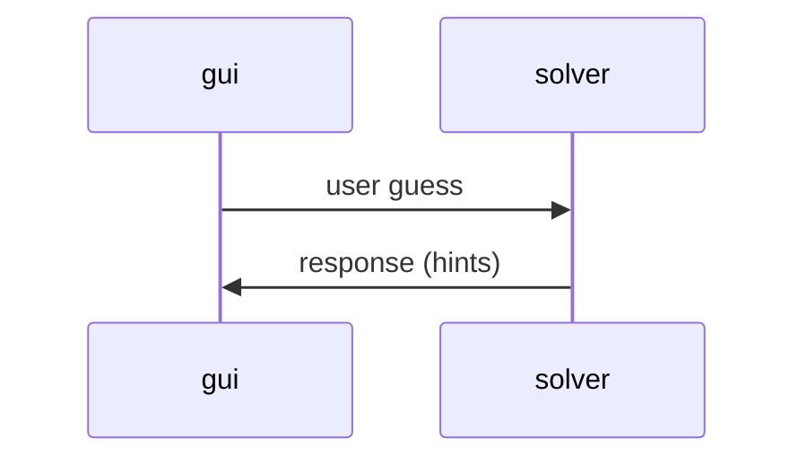

---
# Feel free to add content and custom Front Matter to this file.
# To modify the layout, see https://jekyllrb.com/docs/themes/#overriding-theme-defaults

layout: page
nav_order: 4
---

# Components

{: .note }
Please see [Javadoc](/ics4u/javadoc) for component API documentation.

## Communications Between Core and GUI Components

### Algorithmic Solvers ↔ GUI

### Human Solver ↔ GUI

