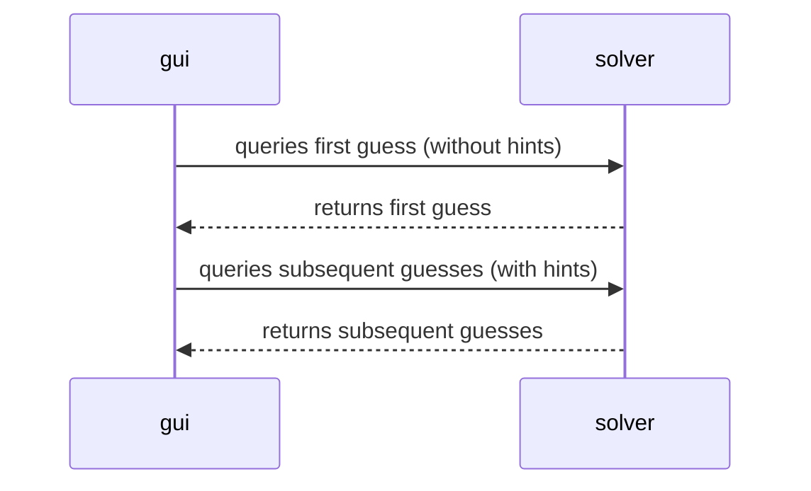
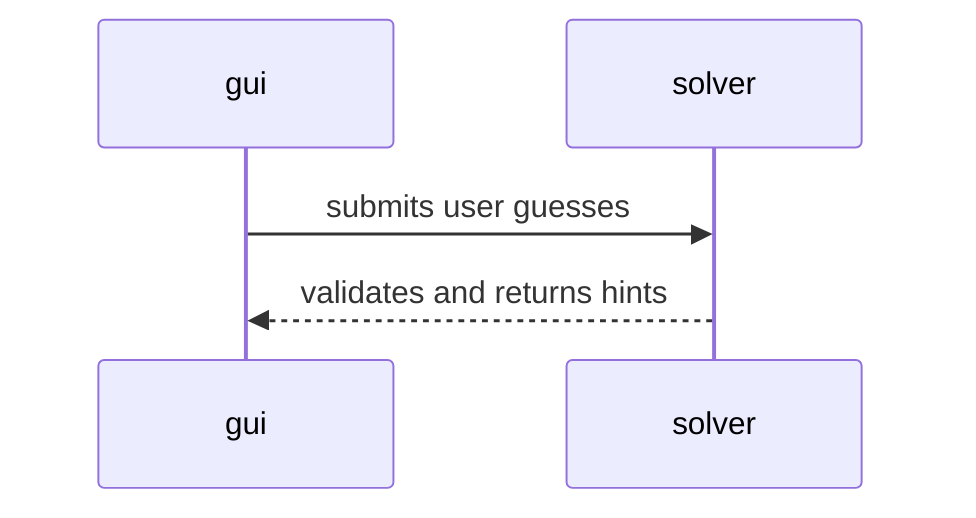

---
# Feel free to add content and custom Front Matter to this file.
# To modify the layout, see https://jekyllrb.com/docs/themes/#overriding-theme-defaults

layout: page
nav_order: 4
---

# Design

{: .note }
Please see [Javadoc](/ics4u/javadoc) for component API documentation.

## Categories of Components

For better organization, the components are divided into the following categories:

- Core
- GUI
- Utils

### Core Logic

Core logic is the rules and logic of the mastermind game, e.g., how hints are
provided, how guesses are validated, etc.

### Core Components

Core components are responsible for the core logic of the program, e.g., solving
the mastermind puzzle. It includes components closely tied to the program's
logic, and would not be reusable by any other program.

Core components may depend on other core components and utils, and not GUI components.

### GUI Components

GUI components are responsible for the user interface of the program. It
includes _scenes_ and _panels_, where _scenes_ are stages of the game, and
_panels_ are common GUI components that can be shared across _scenes_.

GUI components may depend on both core components and utils.

### Utility Components

Utility components are components that don't fit as either _core_ or _GUI_,
i.e., they are general-purpose components that are not coupled with the program
logic.

For example, `Log` and `ANSIColor` are utility components, since although the
program depend on them, they are not part of the core logic nor the GUI.

Utility components may only depend on other utility components, but not core or
GUI.

## Communications Between Core and GUI Components

### Algorithmic Solvers ↔ GUI

### Human Solver ↔ GUI

## Single Responsibility Principle

For the ease of unit testing and maintainability, each class and function should
serve a single purpose.

All components are designed to adhere to the Single Responsibility Principle.

## Separation of Data and Logic

Some components may require loading of external data, e.g., predefined secret
codes for code maker mode, as opposed to pseudo-random generation.

To allow modification to data without changing the source code, data is stored
separately and dynamically loaded at runtime.

## Use of Enumerators

Type safety is ensured by using enumerators to represent constants, e.g., colors,
log severity levels, etc.

## Design Patterns

Various design patterns are employed where appropriate.

For example, singleton for `Log` and dependency injection for `CodeBreaker`.
